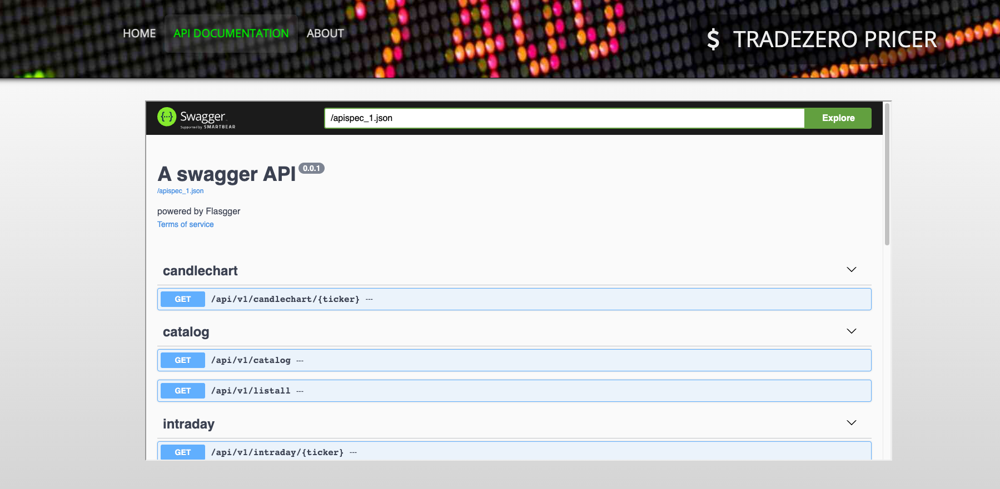

# TradeZero Pricer Backend Microservice

This service is part of the TradeZero application.
The service polls live financial data like stock prices from Yahoo Finance and it exposes it through a REST API.

## Run

### In containers

1. Edit env vars in docker-compose.yml to suit your needs

2. Start containers
```
podman-compose up
```
3. Navigate to http://localhost:8080


### Test Run for development

1. Create venv
```
python3 -m venv tzp_env
source ./tzp_env/bin/activate
```

2. Install requirements
```
pip3 install -r requirements.txt
```

3. Run application

 - Prod mode with Gunicorn WSGI server
```
$ ./boot.sh
```
 - Dev mode
```
$ FLASK_APP=$PWD/tradezero_pricer.py flask run
 * Serving Flask app 'tradezero_pricer.py'
 * Debug mode: on
WARNING: This is a development server...
 * Running on http://127.0.0.1:8080
Press CTRL+C to quit
 * Restarting with stat
 * Debugger is active!
 * Debugger PIN: 860-991-813
```

## Usaga

 * Query stock price
```
curl -X GET "http://127.0.0.1:8080/api/v1/price/<ticker>" -H "accept: application/json"
```

 * Query stock 10-day candlecahrt data
```
curl -X GET "http://127.0.0.1:8080/api/v1/candlechart/<ticker>" -H "accept: application/json"
```

 * Get the entire catalog of stocks under tracking.
```
curl -X GET "http://127.0.0.1:8080/api/v1/catalog" -H "accept: application/json"
```

## API Documentation

Browse http://localhost:8080/apidocs




## Unit Testing

Use pytest or tox to run the unit tests.


```
$ tox -e py310
py310: commands[0]> pytest -W ignore::DeprecationWarning
==================================== test session starts =================================
platform linux -- Python 3.10.9, pytest-7.3.1, pluggy-1.0.0
cachedir: .tox/py310/.pytest_cache
rootdir: /home/maur0x/stuff/fin/tradezero_pricer
collected 5 items

tradezero_pricer/tests/test_api.py ..                                                                                                              [ 40%]
tradezero_pricer/tests/test_main.py ...                                                                                                            [100%]

===================================== 5 passed in 0.94s =================================
  py310: OK (1.80=setup[0.04]+cmd[1.76] seconds)
  congratulations :) (1.85 seconds)

```
